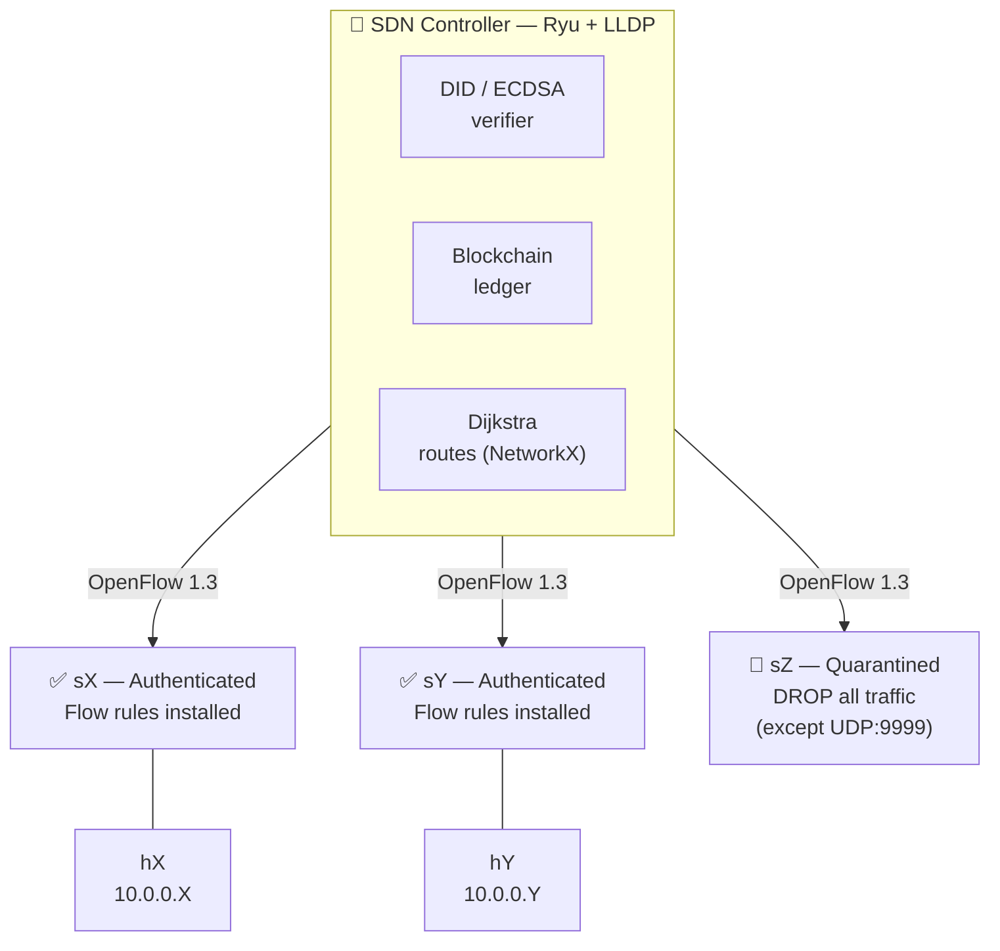
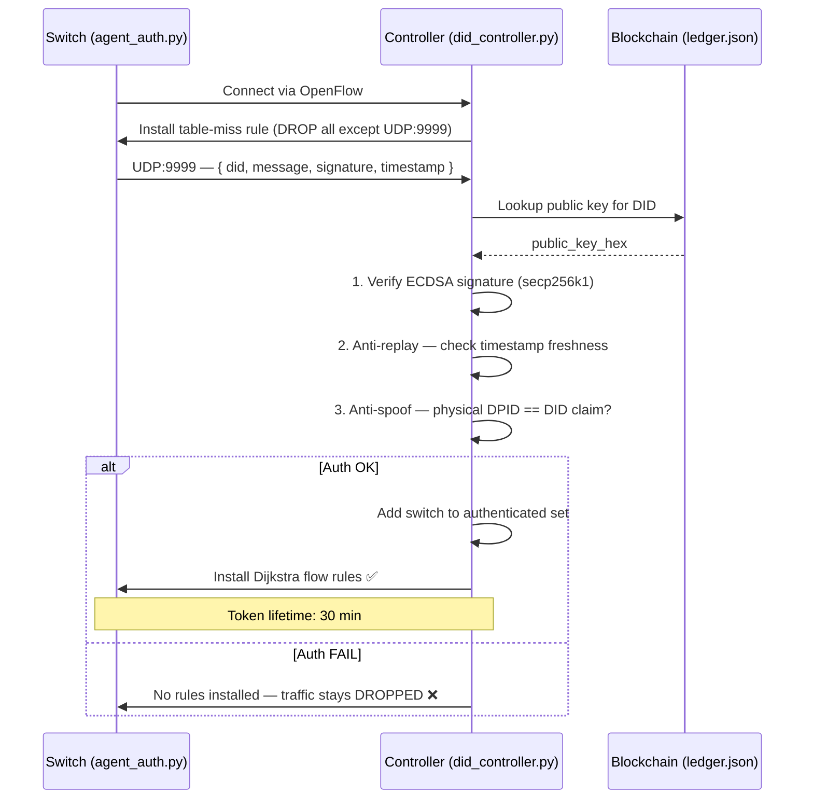

# ZTrust — Zero Trust SDN with Decentralized Identities

> A research prototype combining **Software-Defined Networking**, **Zero Trust architecture**, and **Decentralized Identifiers (DID)** for autonomous switch authentication in a 22-node mesh topology.

---

## Overview

ZTrust implements a Zero Trust security model at the network infrastructure level. Every switch in the topology must cryptographically prove its identity before it is allowed to forward any traffic. Authentication is based on **Decentralized Identifiers (DID)** backed by a local blockchain ledger, with signatures verified using **ECDSA (secp256k1)** — the same curve used by Bitcoin and Ethereum.

The controller dynamically computes optimal routes via **Dijkstra (NetworkX)**, recalculates paths in real time when a switch is quarantined or reconnects, and exposes a **live web dashboard** for monitoring and control.

---

## Architecture



**Zero Trust enforcement:**
- Unauthenticated switch → all traffic dropped except auth packets (UDP 9999)
- Authenticated switch → Dijkstra flow rules installed, traffic forwarded
- Switch disconnected/expired → routes recalculated automatically, hosts unreachable via that path

---

## Key Features

| Feature | Description |
|---|---|
| **DID Authentication** | Each switch holds an ECDSA key pair. The private key signs a timestamped challenge; the controller verifies against the blockchain. |
| **Anti-Replay** | Challenges include a Unix timestamp — old replayed tokens are rejected. |
| **Anti-Spoofing** | Physical DPID is cross-checked against the DID claim. |
| **Token Lifetime** | Auth tokens expire after 30 minutes. Proactive re-auth triggered at T−5 min. |
| **Inactivity Quarantine** | Switch quarantined automatically if no packet seen for 5 minutes. |
| **Dynamic Routing** | Dijkstra on authenticated subgraph only. Deterministic tie-breaking by DPID order. |
| **Live Dashboard** | Real-time vis-network graph, flow tracing, quarantine/restore controls, demo mode. |
| **ECDSA Overhead Tracking** | Verification latency logged per auth event in `/tmp/sdn_overhead.json`. |

---

## Project Structure

```
.
├── DID/
│   ├── did_controller.py      # Ryu controller — Zero Trust + routing
│   ├── blockchain.py          # Local blockchain ledger (SHA-256 chained blocks)
│   ├── agent_auth.py          # Switch authentication agent (runs inside Mininet host)
│   ├── gen_did.py             # DID + key pair generator for all 22 switches
│   ├── full_auth.py           # Bulk authentication script (external, for testing)
│   ├── auth_monitor.py        # Terminal real-time auth monitor
│   ├── dashboard_server.py    # Web dashboard HTTP server (SSE, REST)
│   ├── dashboard.html         # Single-file web UI (vis-network graph)
│   ├── vis-network.min.js     # vis-network 9.1.9 (served locally, no CDN needed)
│   ├── ledger.json            # Pre-generated blockchain ledger (22 switch identities)
│   └── keystore/
│       ├── secrets.json       # ⚠️  Private keys — NOT committed (see .gitignore)
│       └── secrets.example.json  # Structure reference
├── topologies/
│   ├── topo_projet.py         # Mininet topology (22 switches, mesh, auto DID auth)
│   └── monitor.py             # OVS controller connectivity watchdog
├── docs/
│   ├── RESUME_SESSION.txt     # Session notes — Zero Trust core implementation
│   ├── RAPPORT_DASHBOARD.txt  # Dashboard implementation report
│   └── ...
├── requirements.txt
├── install_DEPIN.sh           # Full environment setup script (Debian VM)
└── .gitignore
```

---

## Prerequisites

- **Debian/Ubuntu** Linux (Mininet requires Linux kernel namespaces)
- **Python 3.9+**
- **Mininet** (`sudo apt install mininet`)
- **Open vSwitch** (`sudo apt install openvswitch-switch`)
- **Python dependencies:**

```bash
pip install ecdsa networkx ryu
```

Or use the provided install script:

```bash
chmod +x install_DEPIN.sh && sudo ./install_DEPIN.sh
```

---

## Quick Start

### 1. Generate identities (first time only)

```bash
cd DID
python3 gen_did.py
# Creates keystore/secrets.json and ledger.json
```

> ⚠️ `secrets.json` contains private keys — never share or commit this file.

### 2. Start the Ryu controller

```bash
cd DID
source ../depin_env/bin/activate
ryu-manager --observe-links did_controller.py ryu.topology.switches
```

### 3. Start the Mininet topology

```bash
# In a second terminal
sudo python3 topologies/topo_projet.py
# Starts 22 switches + 22 hosts, injects static ARP, runs DID auth for all switches
```

### 4. Start the web dashboard (optional)

```bash
# In a third terminal
cd DID
sudo python3 dashboard_server.py
# Open http://localhost:8181
```

---

## How Zero Trust Works



---

## Dashboard

The dashboard at `http://localhost:8181` provides:

- **Live topology graph** — 22 nodes colored by auth state (green/yellow/grey)
- **Route highlighting** — edges light up cyan when a ping traverses them
- **Switch detail panel** — DID, token countdown, idle time
- **Actions** — quarantine, restore, re-auth per switch or globally
- **Ping terminal** — SSE-streamed ping with Zero Trust pre-check
- **Flow view** — path captured once per ping (frozen during session)
- **Demo mode** — 15 scripted scenarios cycling automatically
- **Event log** — auth events, expirations, quarantines

---

## Security Notes

- `keystore/secrets.json` is listed in `.gitignore` and must never be committed
- Re-generate keys for any real deployment using `gen_did.py`
- The blockchain ledger (`ledger.json`) contains only public keys — safe to commit
- The controller runs a local blockchain; for production, replace with a distributed ledger

---

## Academic Context

This project explores the intersection of three emerging paradigms:

| Technology | Role in ZTrust |
|---|---|
| **SDN (OpenFlow 1.3)** | Centralized policy enforcement via flow rules |
| **Zero Trust** | "Never trust, always verify" — no implicit network trust |
| **DID (W3C standard)** | Self-sovereign identity without a central authority |

The combination of SDN + Zero Trust + DID/blockchain as an integrated system is not yet established in the literature or industry (existing solutions: ZTNA without SDN, SDN+security with centralized PKI, DID for IoT without SDN networking). This architecture aligns with emerging research from 2023–2025.

---

## Authors

Baptiste Rodrigues — ESME INGE3
