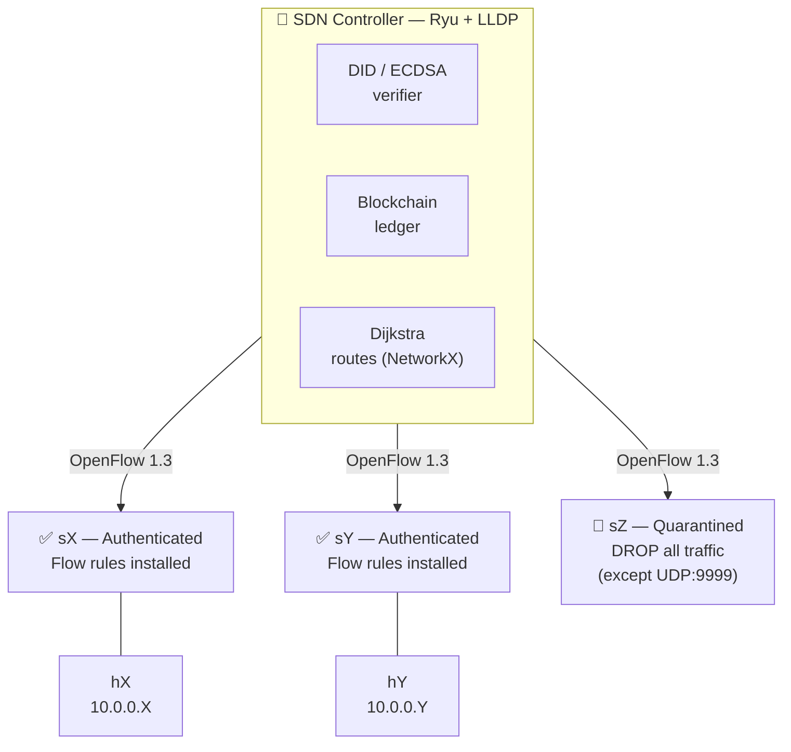
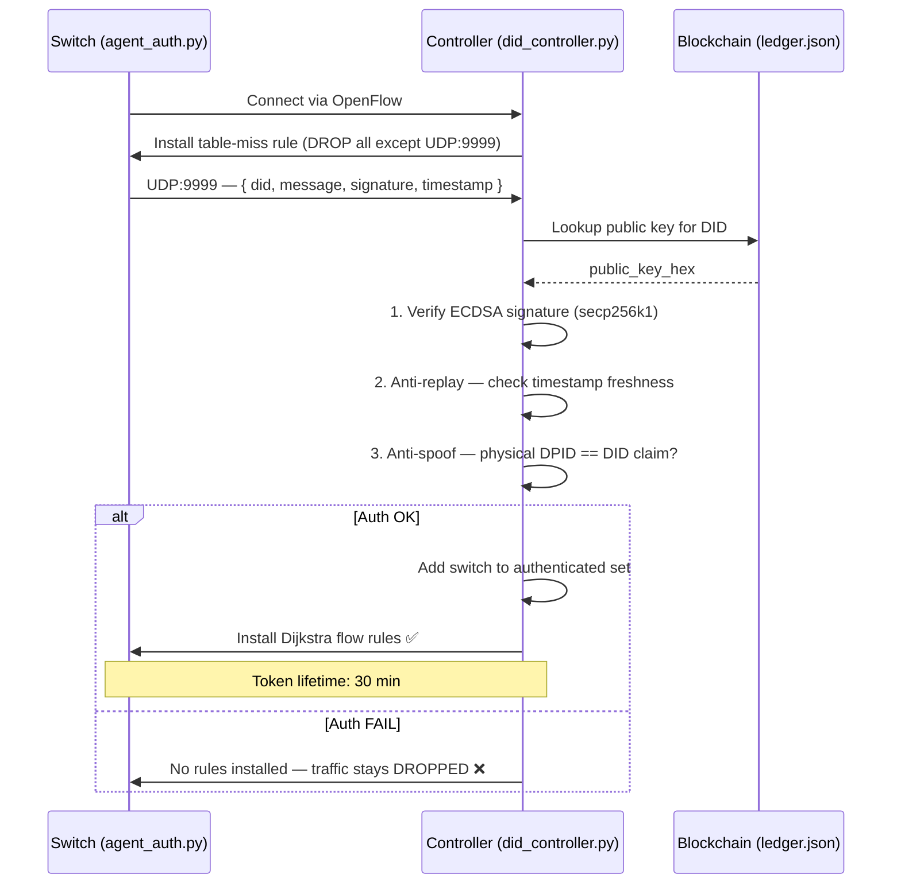

# ZTrust — Zero Trust SDN with Decentralized Identities

> A research prototype combining **Software-Defined Networking**, **Zero Trust architecture**, and **Decentralized Identifiers (DID)** for autonomous switch authentication in a 22-node partial mesh topology (hub-and-spoke extended).

---

## Overview

ZTrust implements a Zero Trust security model at the network infrastructure level. Every switch in the topology must cryptographically prove its identity before it is allowed to forward any traffic. Authentication is based on **Decentralized Identifiers (DID)** backed by a local blockchain ledger, with signatures verified using **ECDSA (secp256k1)** — the same curve used by Bitcoin and Ethereum.

The controller dynamically computes optimal routes via **Dijkstra (NetworkX)**, recalculates paths in real time when a switch is quarantined or reconnects, and exposes a **live web dashboard** for monitoring and control.

---

## Architecture



**Zero Trust enforcement:**
- Unauthenticated switch → all traffic dropped except auth packets (UDP 9999)
- Authenticated switch → Dijkstra flow rules installed, traffic forwarded
- Switch disconnected/expired → routes recalculated automatically, hosts unreachable via that path

---

## Key Features

| Feature | Description |
|---|---|
| **DID Authentication** | Each switch holds an ECDSA key pair. The private key signs a timestamped challenge; the controller verifies against the blockchain. |
| **Anti-Replay** | Challenges include a Unix timestamp — old replayed tokens are rejected. |
| **Anti-Spoofing** | Physical DPID is cross-checked against the DID claim. |
| **Token Lifetime** | Auth tokens expire after 30 minutes. Proactive re-auth triggered at T−5 min. |
| **Inactivity Quarantine** | Switch quarantined automatically if no packet seen for 5 minutes. |
| **Dynamic Routing** | Dijkstra on authenticated subgraph only. Deterministic tie-breaking by DPID order. |
| **Live Dashboard** | Real-time vis-network graph, flow tracing, quarantine/restore controls, demo mode. |
| **ECDSA Overhead Tracking** | Verification latency logged per auth event in `/tmp/sdn_overhead.json`. |

---

## Project Structure

```
.
├── DID/
│   ├── did_controller.py      # Ryu controller — Zero Trust + routing
│   ├── blockchain.py          # Local blockchain ledger — stores W3C DID Documents (SHA-256 chained)
│   ├── did_method_spec.md     # did:depin W3C DID Method specification
│   ├── agent_auth.py          # Switch authentication agent (runs inside Mininet host)
│   ├── gen_did.py             # DID + key pair generator for all 22 switches
│   ├── full_auth.py           # Bulk authentication script (external, for testing)
│   ├── auth_monitor.py        # Terminal real-time auth monitor
│   ├── dashboard_server.py    # Web dashboard HTTP server (SSE, REST)
│   ├── dashboard.html         # Single-file web UI (vis-network graph)
│   ├── vis-network.min.js     # vis-network 9.1.9 (served locally, no CDN needed)
│   ├── ledger.json            # Pre-generated blockchain ledger (22 switch identities)
│   └── keystore/
│       ├── secrets.json       # ⚠️  Private keys — NOT committed (see .gitignore)
│       └── secrets.example.json  # Structure reference
├── topologies/
│   ├── topo_projet.py         # Mininet topology (22 switches, mesh, auto DID auth)
│   └── monitor.py             # OVS controller connectivity watchdog
├── docs/
│   ├── RESUME_SESSION.txt     # Session notes — Zero Trust core implementation
│   ├── RAPPORT_DASHBOARD.txt  # Dashboard implementation report
│   └── ...
├── requirements.txt
├── install_DEPIN.sh           # Full environment setup script (Debian VM)
└── .gitignore
```

---

## Prerequisites

- **Debian/Ubuntu** Linux (Mininet requires Linux kernel namespaces)
- **Python 3.9+**
- **Mininet** (`sudo apt install mininet`)
- **Open vSwitch** (`sudo apt install openvswitch-switch`)
- **Python dependencies:**

```bash
pip install ecdsa networkx ryu
```

Or use the provided install script:

```bash
chmod +x install_DEPIN.sh && sudo ./install_DEPIN.sh
```

---

## Quick Start

### 1. Generate identities (first time only)

```bash
cd DID
python3 gen_did.py
# Creates keystore/secrets.json and ledger.json
```

> ⚠️ `secrets.json` contains private keys — never share or commit this file.

### 2. Start the Ryu controller

```bash
cd DID
source ../depin_env/bin/activate
ryu-manager --observe-links did_controller.py ryu.topology.switches
```

### 3. Start the Mininet topology

```bash
# In a second terminal
sudo python3 topologies/topo_projet.py
# Starts 22 switches + 22 hosts, injects static ARP, runs DID auth for all switches
```

### 4. Start the web dashboard (optional)

```bash
# In a third terminal
cd DID
sudo python3 dashboard_server.py
# Open http://localhost:8181
```

---

## How Zero Trust Works



---

## Attack Simulation

> **Branch:** this suite lives on the [`attack-scenarios`](../../tree/attack-scenarios) branch.
> ```bash
> git checkout attack-scenarios
> ```

`DID/attack_simulation.py` validates each Zero Trust enforcement layer with a concrete adversarial scenario. The script requires both Ryu and Mininet to be running:

```bash
sudo python3 DID/attack_simulation.py
```

**Test methodology:** before each attack, the attacker switch is disconnected from the controller and reconnected cleanly (`ovs-vsctl del-controller` / `set-controller`). This ensures it starts unauthenticated, as if a compromised node had just rejoined the network. The script then checks `sdn_auth_status.json` to verify the controller's reaction.

---

### Attack 1 — Fake ECDSA Signature

**Threat:** an attacker knows a valid DID (e.g. by sniffing the network) but does not hold the corresponding private key. It sends an auth packet with the correct DID and a random 64-byte value as the signature.

**What the script does:** s18 is reset to `connected`, then sends `{ did: "did:ztrust:switch_18", signature: <64 random bytes> }` over UDP:9999.

**Defense:** `verify_signature()` calls `VerifyingKey.verify()` (ECDSA secp256k1) against the public key stored in the blockchain. A random signature is cryptographically invalid — verification raises `BadSignatureError` and the function returns `False`. The controller drops the packet without updating the auth state.

**Expected result:** s18 remains in state `connected` — it is never added to the authenticated set and receives no flow rules.

---

### Attack 2 — DPID Spoofing / Impersonation

**Threat:** an attacker compromises a legitimate switch (s1) and steals its private key. It then uses that key to authenticate from a *different* physical switch (s19), trying to inherit s1's trusted identity.

**What the script does:** s19 is reset, then sends a *cryptographically valid* auth packet signed with s1's private key and containing s1's DID (`did:ztrust:switch_1`). This packet passes ECDSA verification but arrives at the controller tagged with DPID=19.

**Defense:** after signature verification, the controller extracts the numeric switch ID from the DID (`switch_1` → `1`) and compares it to the physical DPID of the incoming connection (`19`). Since `19 ≠ 1`, the controller prints `SPOOFING DETECTED` and returns without authenticating.

**Expected result:** s19 remains `connected`. s1 (the victim) is unaffected and stays `auth`.

---

### Attack 3 — Traffic Injection Without Authentication

**Threat:** a node on the network attempts to send data frames before authenticating — either because it skipped the DID handshake or its token was revoked.

**What the script does:** s20 is reset and left unauthenticated. h20 (attached to s20) sends 3 ICMP ping packets to h1 (`10.0.0.1`).

**Defense:** when a switch connects, the controller immediately installs a single priority-0 table-miss rule: *any packet that does not match a higher-priority rule is sent to the controller*. No higher-priority rules exist for unauthenticated switches (Dijkstra flow rules are only installed after a successful DID auth). The controller's `_packet_in_handler` receives the packet, sees that `dpid not in authenticated_dpid`, checks that it is not a UDP:9999 auth packet, and **silently drops it** (returns without forwarding).

**Expected result:** 100% packet loss on all 3 pings — no frame reaches h1.

---

### Attack 4 — Isolation (Collateral Damage Check)

**Threat:** the three attacks above could, through a bug or race condition, accidentally revoke the authentication of legitimate switches (e.g. by corrupting shared state or triggering a route recalculation that blocks valid paths).

**What the script does:** after attacks 1–3, the script reads the auth state of s1, s2, and s3 (which were authenticated before the suite started and were never targeted). It also runs a live ping from h1 to h2 to confirm that legitimate traffic still flows.

**Defense:** the controller's auth state is per-DPID and isolated — revoking or blocking one switch has no side effect on others. Route recalculations triggered by quarantine events only remove paths *through* the affected switch; paths between authenticated switches are recomputed and reinstalled.

**Expected result:** s1, s2, s3 all remain in state `auth`. h1 → h2 ping succeeds.

---

### Attack 5 — Timestamp Replay

**Threat:** an attacker captures a valid, signed auth packet from the network and replays it later. Even though the ECDSA signature is genuine, the packet is stale — the switch may have since been revoked or the session expired.

**What the script does:** s21 is reset, then the script builds a *cryptographically valid* signed packet (correct DID, correct signature) but sets the `timestamp` field to `now − 31 seconds`. The packet is sent over UDP:9999.

**Defense:** `_handle_auth_packet()` reads the `timestamp` field from the JSON payload and checks `abs(time.time() - float(ts)) > 30`. A 31-second-old packet exceeds the 30-second window — the controller logs a warning and returns immediately, before even reaching ECDSA verification.

**Expected result:** s21 remains `connected` — the stale packet is rejected at the freshness gate.

---

### Results

```
✓ PASS  Attack 1 — Fake ECDSA signature
✓ PASS  Attack 2 — DPID spoofing / impersonation
✓ PASS  Attack 3 — Traffic injection without auth
✓ PASS  Attack 4 — Isolation (legitimate nodes)
✓ PASS  Attack 5 — Timestamp replay (stale packet)

All defenses validated — impact confined to attacked nodes.
```

Full results are saved to `/tmp/attack_results.json` after each run.

---

## Dashboard

The dashboard at `http://localhost:8181` provides:

- **Live topology graph** — 22 nodes colored by auth state (green/yellow/grey)
- **Route highlighting** — edges light up cyan when a ping traverses them
- **Switch detail panel** — DID, token countdown, idle time
- **Actions** — quarantine, restore, re-auth per switch or globally
- **Ping terminal** — SSE-streamed ping with Zero Trust pre-check
- **Flow view** — path captured once per ping (frozen during session)
- **Demo mode** — 15 scripted scenarios cycling automatically
- **Event log** — auth events, expirations, quarantines

---

## Known Limitations

- **Local blockchain** — `ledger.json` is a single-node, non-distributed ledger. A host with write access to this file could replace it without consensus. For production, replace with a distributed ledger (e.g. Hyperledger Fabric).
- **OpenFlow without TLS** — the controller-to-switch channel (TCP 6633) is unencrypted. A MitM on the management network could inject or modify flow rules.
- **Anti-replay scope** — prior to the current version, incoming auth packets were validated only by token expiry (30 min lifetime) with no freshness check on the packet timestamp itself, leaving a 30-minute replay window. Fixed: `_handle_auth_packet()` now rejects packets where `abs(now − ts) > 30 s`.

---

## Security Notes

- `keystore/secrets.json` is listed in `.gitignore` and must never be committed
- Re-generate keys for any real deployment using `gen_did.py`
- The blockchain ledger (`ledger.json`) contains only public keys — safe to commit
- The controller runs a local blockchain; for production, replace with a distributed ledger

---

## DID Method — `did:depin`

ZTrust implements a custom W3C-compliant DID Method named **`did:depin`**. Each switch is identified by a stable DID of the form `did:depin:switch_N` (e.g. `did:depin:switch_1`). The blockchain ledger stores full **W3C DID Documents** — not just raw public keys — including:

- `verificationMethod` — ECDSA secp256k1 public key (`EcdsaSecp256k1VerificationKey2019`)
- `authentication` — reference to the key used to authenticate the switch
- `service` — SDN controller endpoint (`udp://controller:9999`)
- `flow_policy` — ZTrust extension: per-switch traffic policy

**CRUD operations:**

| Operation | Method | Description |
|---|---|---|
| **Create** | `Blockchain.add_identity(did, pub_key_hex)` | Appends a new DID Document block to the ledger |
| **Read** | `Blockchain.resolve(did)` | Returns the latest non-revoked DID Document |
| **Update** | `Blockchain.add_identity(did, new_pub_key_hex)` | New block supersedes the previous one (latest wins) |
| **Revoke** | `Blockchain.revoke_identity(did)` | Appends a revocation block — `resolve()` returns `None` |

The full method specification (syntax, security considerations, privacy) is in [`DID/did_method_spec.md`](DID/did_method_spec.md).

---

## Academic Context

This project explores the intersection of three emerging paradigms:

| Technology | Role in ZTrust |
|---|---|
| **SDN (OpenFlow 1.3)** | Centralized policy enforcement via flow rules |
| **Zero Trust** | "Never trust, always verify" — no implicit network trust |
| **DID (W3C-compliant, did:depin method)** | Self-sovereign identity without a central authority — see `DID/did_method_spec.md` |

The combination of SDN + Zero Trust + DID/blockchain as an integrated system is not yet established in the literature or industry (existing solutions: ZTNA without SDN, SDN+security with centralized PKI, DID for IoT without SDN networking). This architecture aligns with emerging research from 2023–2025.

---

## Authors

Baptiste Rodrigues — ESME INGE3
